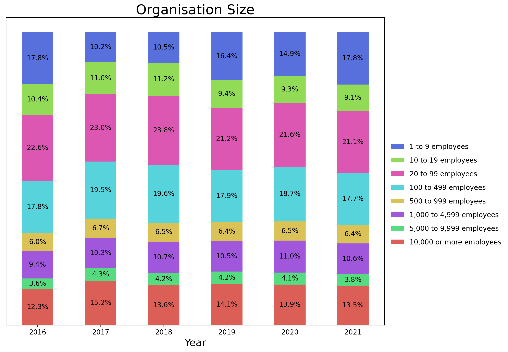
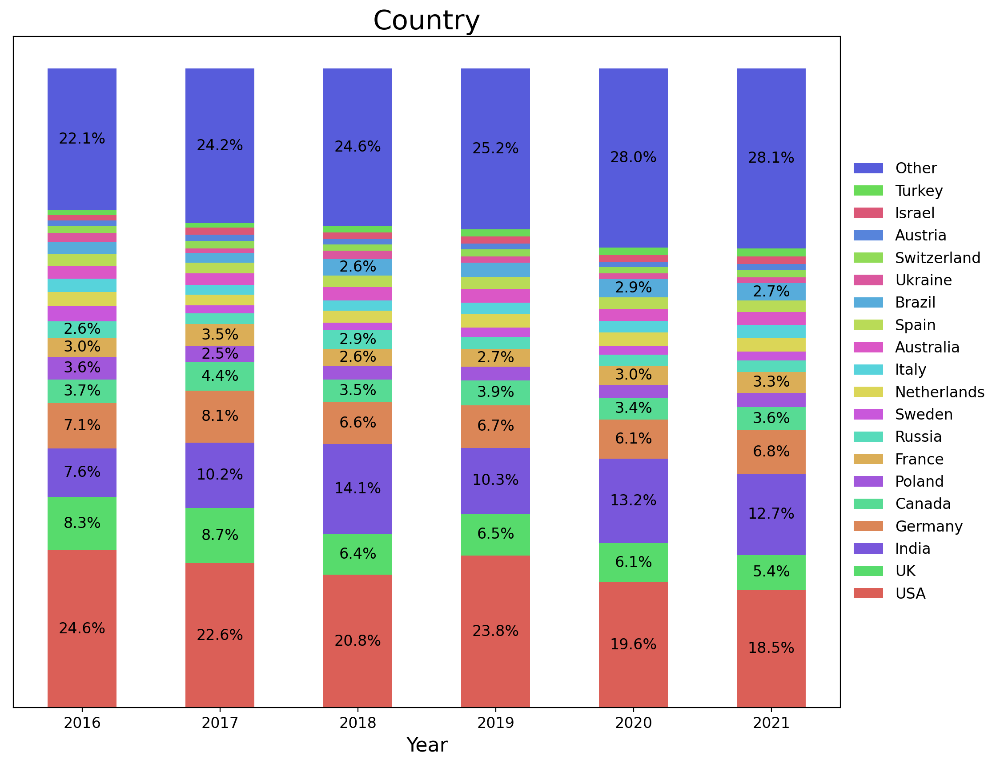
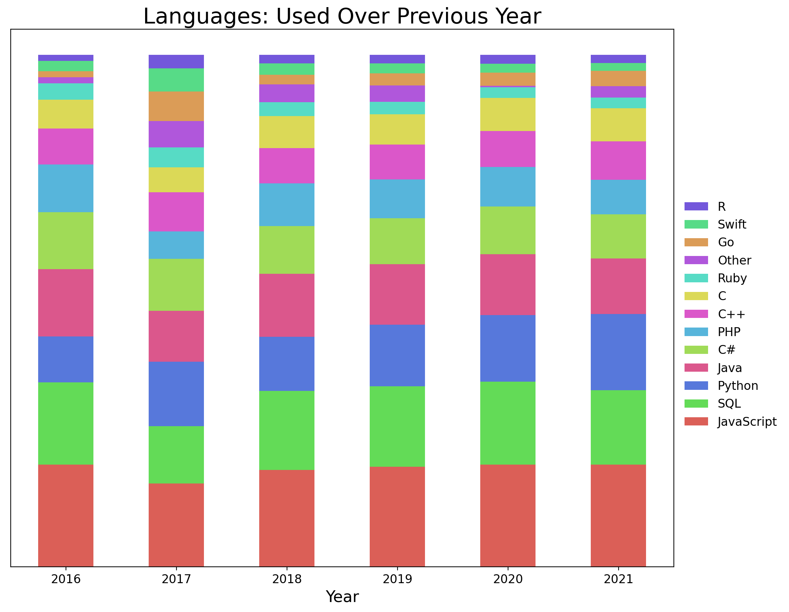
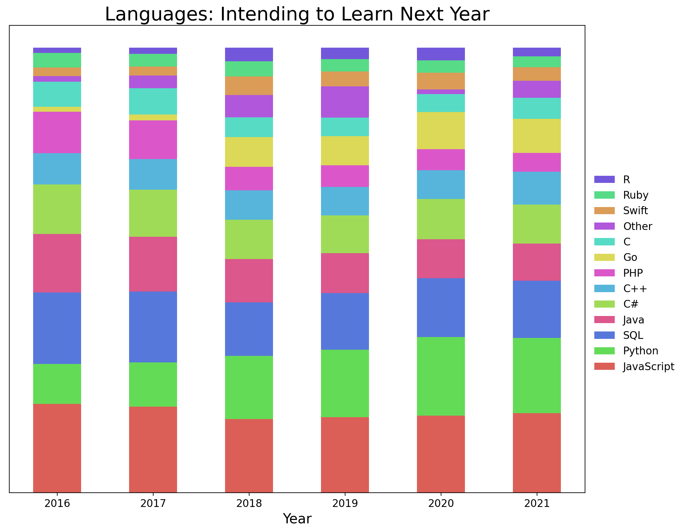

# Introduction

What's next in the world of tech? If you're looking for your first job in a technology-related field, or looking to advance in your field, you likely somewhere in the region of have 0.5 of an eye to one full Sauron trained on anticipating trends in tech.

Sometimes it seems that the world and his dog has advice to impart about where they think a tech aspirant should be concentrating their efforts in order to advance their career, but it usually pays to be guided by objective data. To this end, one may examine data gathered by Stack Overflow, which carries out an annual self-report survey on its userbase. It has been doing so since 2011, and publishes its data [here](https://insights.stackoverflow.com/survey/). They ask novel and creative questions each year (turns out more people like Star Wars than Star Trek, which is absolutely fine by me, not a problem, not bothered in the slightest, some people have no taste, whatever), but there are some common threads that can be pulled out over time in order to discern some possible trends as we move into 2022 and beyond.

Here is what I've found after investigating in detail the data for 2016 to 2021 inclusive:

# Will There Still Be Space For the Little Guy?

With representations of technology in the news and popular culture, you'd be forgiven for thinking it was the preserve of awkward, other-worldly tech gurus at the head of vast corporations - Steve Jobs, Bill Gates, Jeff Bezos, Elon Musk, Mark Zuckerberg. Should we, then, be preparing ourselves for having to work under the likes of Mark Rylance's Peter Isherwell in *Don't Look Up*? Or is there still some space for the little guy? How are small to medium-size enterprises faring, and is there any evidence from the Stack Overflow developer data that things are moving towards big tech eclipsing everything?

Well, assuming that changes in the Stack Overflow responses will be mirrored in the larger tech community, at least the anglophone community, things appear to have been fairly stable in terms of the size of company respondents work for:

The most common category in terms of organisation size is the medium-size enterprise (20-99 employees), and this remains the case throughout the time period in question, with approximately 22% of respondents (of those who answered this question) selecting that category in any given year. And small businesses remain hale and hearty throughout the period, with over 20% of respondents in companies of under 20 employees in every year, and no obvious trend over the period. So good news, people: if you don't want to work for Peter Isherwell, you probably won't have to!

But come on, why wouldn't you want to? He has an algorithm that will tell you how you're going to die. Perhaps this algorithm uses quantum mechanics and parabolic calculus? (That little doozy of Treknobabble was from _Source Code_, in case you're trying to place it. It's a \*chef's kiss\* of the genre.)

Whilst we're on the subject of US cultural pollution, a good question to ask at this point is...

# Will the Tech World Still Be US-Dominated?

Obviously, the data I'm relying on here is Stack Overflow's Developer Survey, an English language site, so one would not be expecting a plethora of Chinese-speaking coders. So what follows is restricted in scope to the anglophone tech world. With that disclaimer in mind, there are some things of note:

* The dominance of the US is declining. With the exception of 2019, the proportion of Stack Overflow users hailing from the US goes down by about 1% every year.
* The UK is also going backwards, relatively-speaking. The proportion of UK users declined from 8.7% in 2017 to 5.4% in 2021.
* No one country is benefitting in particular - rather, 'Other' seems to be the only category that is experiencing consistent growth as more and more countries develop the infrastructure needed to sustain a tech industry. Intuitively, I would have expected India to have surged forward in this time period, but that is not the case. It's possible that skilled users in India are simply emigrating once they've built up a sufficient portfolio of skills in India.

This matters, I would say, because it underlines what people out there looking for jobs already understand - it's competitive out there, and it's getting more competitive. Thus, it pays to look for anything that might give you an edge in the jobs market. This brings me to...

# What Programming Languages Will We Be Using?

There's two ways to think about this question from the survey data - one is to look at what programming languages people *have* been using over the past year, and other is to look at what they're _going_ to learn over the next year.

A word of warning here. Respondents are able to tick more than one box on both these questions, so what we're looking at here are the *mentions* for each programming language. Now, because respondents know, on average, around 4 programming languages each, all the languages are all more popular than looking at the number of mentions will make it appear. So, as you will see shortly, in 2021 Javascript gets 20% of the mentions, so poor old Javascript might be feeling like the kid who gets picked last at sport.

But in reality, 64% of developers had used it over the past year, so Javascript is really popular. It's just that there's lots of other languages that programmers are *also* using.

Anyway, without any more prevarication, let's look at the data:

Apart from the slightly anomalous results from 2017 due to subtle variations in the way the survey was carried out, the overall picture is that the proportions in terms of which programming languages respondents mention are relatively constant.

However, it does appear that Python is becoming increasingly popular. It would seem that knowing Java, JavaScript and SQL, as well as some variant of C, all remain solid career options and are likely to remain so for the foreseeable future. Learn them or get a cat and sit on a bench, I guess.

But what of the languages people are looking to learn? Are there any insights to be gleaned there?

Here we see that aspirations to learn the most popular languages (JavaScript, Python, SQL, Java, C, C#, C++, PHP) more or less match their actual usage, which probably reflects the belief that these languages will continue to be useful in the future.

That said, one notable trend is the Go has managed to squeeze in there in terms of people's programming aspirations. This is presumably because it has the support of Alphabet and thus it is seen as the next big thing. Note, though, that it is remaining an aspiration, with no particular growth in terms of actual usage. Thus, based on the data, I wouldn't advise going out of my way to learn Go. Sorry Peter... Wait. Who runs Google?

# Conclusions

OK, so what should you be doing to enhance your career prospects? Based on the data, my advice would be:

* Don't worry unduly about locating yourself in the US. Tech really is a global phenomenon.
* Don't think you have to sell your soul to Big Tech. You don't.
* JavaScript, Python, SQL, Java, C, C#, C++, and PHP are solid choices in terms of programming languages.

What's the programming language you're going to pick up next?
